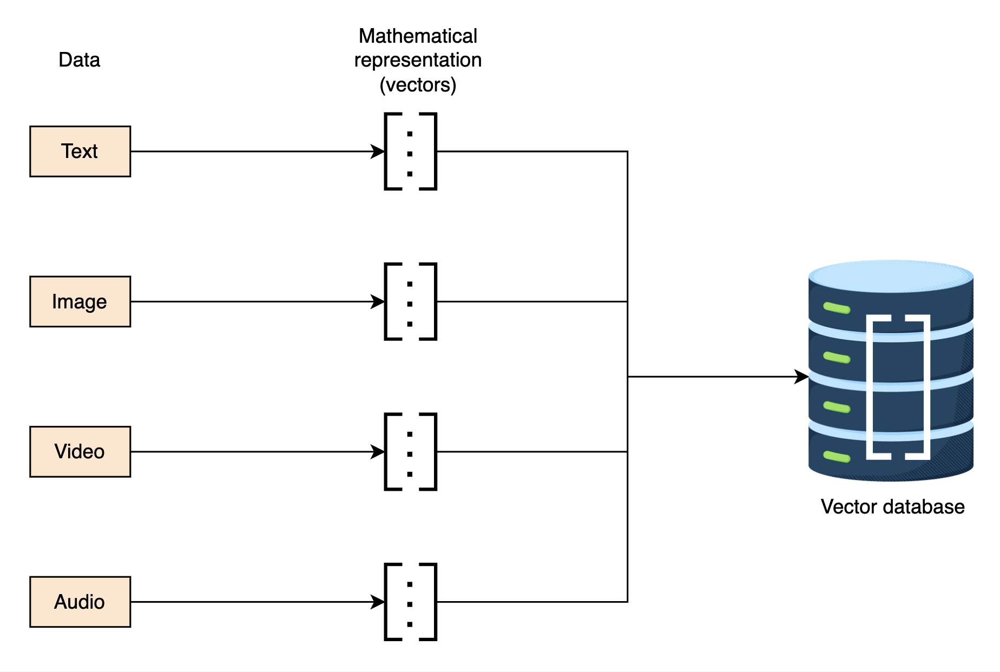
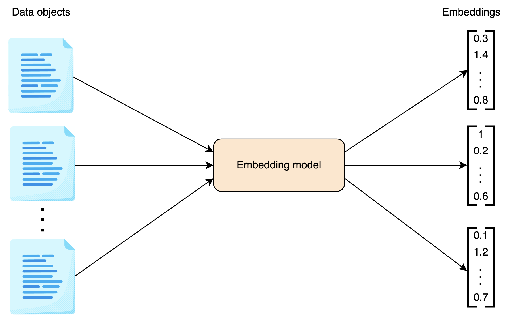
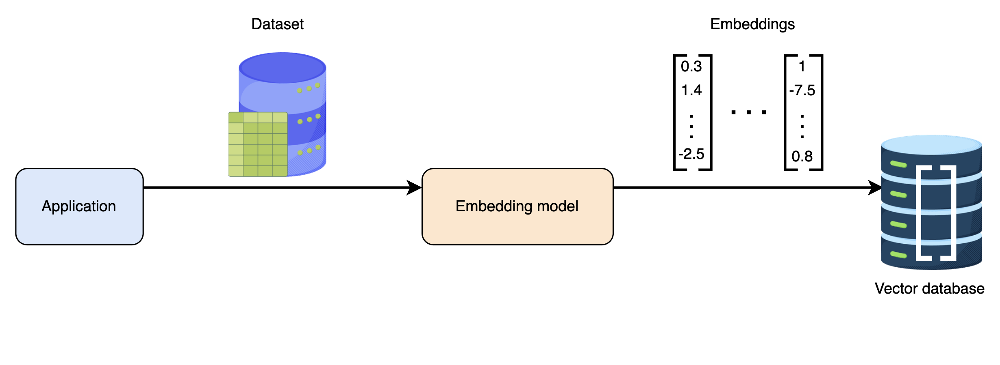
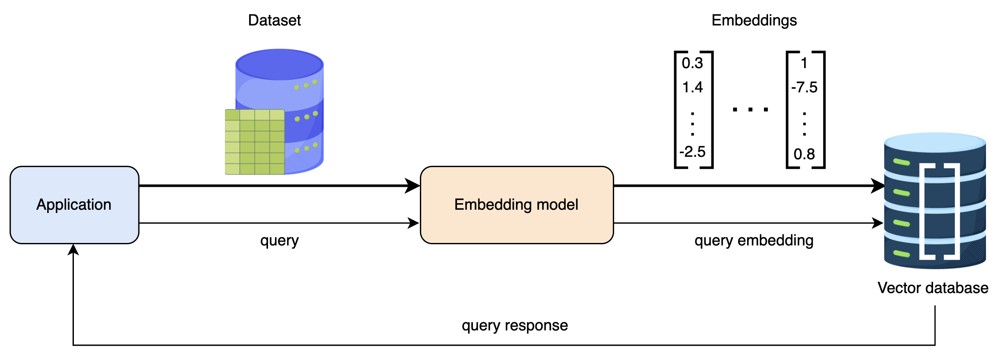

### **Vector Database and Embeddings: Key Points and Subpoints**

---

## **1\. What is a Vector Database?**

A **vector database** is a specialized type of database designed to store and manage data in **vectorized form**. It is particularly useful for **high-dimensional** and **complex data** like text, images, audio, and video.

### **1.1. Definition and Purpose**

- Stores data in **numerical form** (vectors).
- Enables **efficient storage, retrieval, and search** of complex data.
- Uses **mathematical techniques** to compare, cluster, and analyze data.

### **1.2. Structure of Vectors in a Vector Database**

- A **vector** is an **array of numbers**, where each number represents a specific characteristic of the data.
- Each **dimension of a vector** captures a different feature of the data object.
- Example: A vector representing an **image** might include:
  - **Pixel intensity**
  - **Color channels (RGB)**
  - **Texture features**
  - **Spatial location**

### **1.3. Advantages of Vector Databases**

- **Efficient handling of heterogeneous data** (text, images, audio, video, etc.).
- **Enables similarity-based searches**, crucial for AI and ML applications.
- **Optimized for high-dimensional data**, which traditional relational databases struggle with.

---

## **2\. What are Vector Embeddings?**

### **2.1. Definition of Embeddings**

- A **vector** is just an array of numbers, but when these numbers encode **meaningful information** about data (structure, properties, semantics, etc.), it is called a **vector embedding**.

### **2.2. Purpose of Embeddings**

- Embeddings help **convert unstructured data** into a numerical format that a computer can understand.
- They **capture semantic relationships** between objects.
- Used in **AI, machine learning, and deep learning models** for processing complex data.

### **2.3. Examples of Embeddings**

- **Word embeddings**: Captures meaning and context of words.
- **Image embeddings**: Captures texture, color, and object details.
- **Video embeddings**: Captures motion, object tracking, and scenes.
- **Audio embeddings**: Captures pitch, frequency, and tone.

---

## **3\. How are Embeddings Generated?**

### **3.1. Embedding Models**

- **Machine learning models** convert raw data (text, image, video, etc.) into numerical representations.
- Different embedding models are used for different data types.
- Examples:

  - **Word2Vec, GloVe** (for text embeddings).
  - **ResNet, VGG, CLIP** (for image embeddings).
  - **MFCC, Wav2Vec** (for audio embeddings).

  

### **3.2. Process of Generating Embeddings**

1.  **Input Data** → Raw data (text, image, video, etc.).
2.  **Pass through an Embedding Model** → Converts it into a numerical vector.
3.  **Output** → High-dimensional embedding vector representing the essential features of the input.

---

## **4\. Relationship Between Vector Databases and Embeddings**

### **4.1. Role of Vector Databases in Embedding Management**

- A **vector database** acts as a **repository for embeddings**.
- It enables **efficient indexing, searching, and retrieval** of embeddings.

### **4.2. Importance in AI and ML Applications**

- **Similarity search**
- **Recommendation systems**
- **Clustering and classification**
- **Anomaly detection**

---

## **5\. How Vector Databases Perform Similarity Search?**

### **5.1. Steps to Find Similar Images Using a Vector Database**

#### **Step 1: Generate Embeddings**

- Images are **fed into an image embedding model** (e.g., ResNet, CLIP).
- The model **outputs a high-dimensional vector** for each image.

#### **Step 2: Store Embeddings**

- The embedding vectors are **stored in the vector database**.
- The database **indexes** them efficiently for quick retrieval.

#### **Step 3: Query Processing**

- A **user submits a query image**.
- The query image is **converted into an embedding** using the same model.

#### **Step 4: Similarity Search**

- The **vector database compares the query embedding** with stored embeddings.
- Similarity is measured using **mathematical distance metrics**, such as:
  - **Euclidean distance**
  - **Cosine similarity**
  - **Manhattan distance**

#### **Step 5: Return Results**

- The database **retrieves the most similar images** based on vector similarity.
- These similar images are sent back as **search results**.

---

## **6\. Real-World Applications of Vector Databases**

### **6.1. Image and Video Search**

- Google Reverse Image Search uses embeddings to find similar images.

### **6.2. Recommendation Systems**

- YouTube, Netflix, and Spotify use embeddings to recommend videos, movies, and songs.

### **6.3. Facial Recognition**

- Security systems compare facial embeddings for authentication.

### **6.4. NLP and Chatbots**

- Language models use text embeddings for understanding context and meaning.

### **6.5. Fraud Detection and Anomaly Detection**

- Embeddings help detect unusual transactions in banking.

---

## **7\. Summary**

- **Vector databases store and manage embeddings** for complex data types.
- **Embeddings represent meaningful numerical representations** of data objects.
- **Vector databases enable similarity search, recommendation, and clustering.**
- **They use embedding models** (e.g., Word2Vec, ResNet) to generate numerical vectors.
- **Similarity searches use distance metrics** (Euclidean, cosine similarity) to find related objects.
