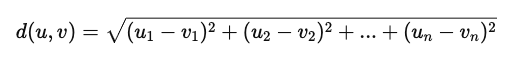

### **Understanding Methods for Measuring Similarity Between Embeddings (With Simple Examples)**

When we work with **vector embeddings**, we often need to measure **how similar or different** two vectors are. For this, we use **mathematical methods** that help compare them.

Imagine you are shopping for a new pair of **shoes** online, and the website recommends some options based on your previous choices. How does the website decide which shoes are similar to the ones you like? The answer lies in how it measures **similarity between vector embeddings**.

Let's break this concept into three main **similarity measures**:

1.  **Euclidean Distance** -- Measures how far two vectors are from each other. (Like measuring the straight-line distance between two cities on a map.)
2.  **Cosine Similarity** -- Measures how "aligned" two vectors are in direction. (Like comparing the angle between two arrows.)
3.  **Dot Product** -- Measures how much one vector extends in the direction of another. (Like checking how much two financial investments contribute to a portfolio.)

We will explore each method in detail with **real-world examples** so that you understand them fully.

## **1\. Euclidean Distance (How Far Apart Are Two Vectors?)**

### **Concept**

Euclidean Distance is the most basic way to compare two points in space. It measures the **shortest straight-line distance** between them, just like measuring the distance between two cities on a map.

### **Formula**

For two vectors **u** and **v**, each having **n** dimensions (features):



This formula calculates the sum of squared differences between corresponding elements in both vectors and then takes the square root.

### **Real-World Example**

Imagine you are at **Point A (2, 3)** on a map, and your friend is at **Point B (5, 7)**. How do you find the shortest distance between you and your friend?

Using Euclidean distance:


### **Example in Python**

Let's use Python to calculate the Euclidean distance between two simple embeddings:

```python

from sklearn.metrics.pairwise import euclidean_distances
import numpy as np

# Define two sample vector embeddings

embedding1 = np.array([[2, 3]])
embedding2 = np.array([[5, 7]])

# Calculate Euclidean distance

distance = euclidean_distances(embedding1, embedding2)[0][0]

print("Euclidean Distance:", distance)

```

**Output:**

```yaml
Euclidean Distance: 5.0
```

### **Key Characteristics of Euclidean Distance**

✅ **Magnitude-sensitive:** If one vector is much larger than the other, Euclidean distance will be high, even if they are in the same direction.

✅ **Scale-dependent:** If the numbers in the dataset are not normalized, larger values can dominate the distance calculation.

✅ **Best for spatial comparisons:** Works well when you need to measure "how far apart" two things are, like locations, colors, or numerical values.
